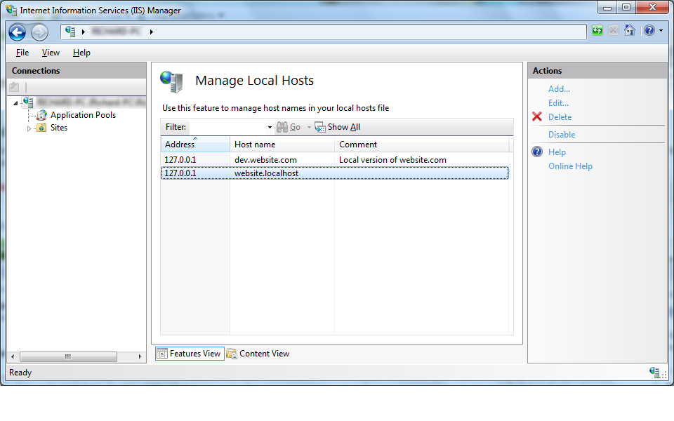

**Project Description**
Provides local hosts file management from within IIS 7, including bulk editing.

Hosts File Manager allows local host entries (in %windir%\system32\drivers\etc) to be edited from within IIS Manager. In addition to providing a GUI, IIS Manager can also provide integration into individual websites on the local machine. IIS Manager is also auto-elevated in Windows 7, making the process even smoother.

## Features

* Does not modify the formatting of existing entries (even when modified)
* Supports enabling/disabling entries (commenting them out)
* Integration into IIS 7(.5)
* Inherit's IIS 7 auto-elevation in Windows 7

## Release Notes

**1.0**
* [Bulk editing](Editing-Host-Entries)
* [Address switching](Host-Switching) (also [across site bindings](Editing-Site-Binding-Host-Entries))
* [Documentation](http://iishosts.codeplex.com/documentation)
* Remote management
* Significant installer improvements

**Release 1**
* Initial release with installer
* Supports create/edit/delete and enable/disable
* Address field is automatically populated with local IP addresses
* Local connections only

**Warning: The installer for Release 1 does not check for IIS7 but will not fail if it is not found**

**Warning: Do not install Release 1 x86 on Windows Vista/7 x64. The installation will fail, but appear to be successful. Uninstall and download the correct version**

## Roadmap

**1.5**
* Host entry groupings (including by site)
* Host entry re-ordering
* Clean up options (remove disabled, remove unused)